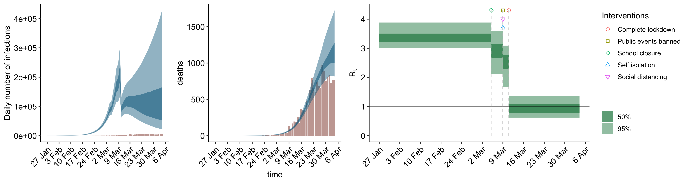
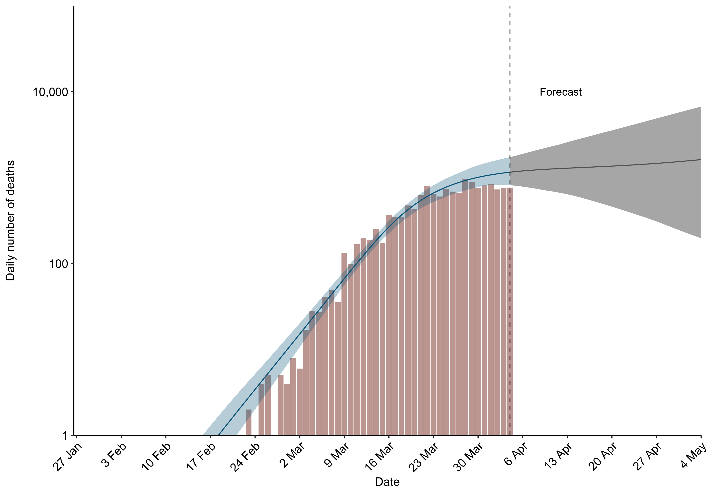

Adapation of the COVID-19 intervention/fatality hierarchical Bayesian model of Flaxman et al.
=============================================================================================

This analysis pipeline is an adaption of the hierarchical model described by Flaxman et al. in:

https://www.imperial.ac.uk/media/imperial-college/medicine/sph/ide/gida-fellowships/Imperial-College-COVID19-Europe-estimates-and-NPI-impact-30-03-2020.pdf

The authors have very kindly made available their code here:

https://github.com/ImperialCollegeLondon/covid19model/releases/tag/v1.0

We were able to reproduce the results of the above article
(based on data available up to March 28, 2020, with a 7-day death count forecast window).

We have since made slight adaptions in order to:

*  use data up April 4, 2020, and
*  use a 30-day forecast window.

Execution reqirements
---------------------
*  Internet connection (to download up-to-date COVID-19 data)
*  R v3.6.2
*  R packages: gdata, EnvStats, ggplot2, tidyr, dplyr, rstan, data.table, lubridate, gdata,
   matrixStats, scales, gridExtra, ggpubr, bayesplot, cowplot, readr

How to execute the pipeline
---------------------------
Clone this repository by running the following at the command line:

```
git clone https://github.com/kennethchu-statcan/covid19.git
```

Change directory to the folder of this pipeline in the local cloned repository:

```
cd <LOCAL CLONED REPOSITORY>/003-imperial-model-1.0/
```

If you are using a Linux or macOS computer, execute the following shell script (in order to run the full pipeline):

```
.\run-main.sh
```

If you are using a Windows computer, execute the following batch script at the Command Prompt instead (NOT tested):

```
.\run-main.bat
```

This will trigger the creation of the output folder
`<LOCAL CLONED REPOSITORY>/003-imperial-model-1.0/output/`
if it does not already exist, followed by execution of the pipeline.
All output and log files will be saved to the output folder.
See below for information about the contents of the output folder.

Input files
-----------
The input files are located in
`<LOCAL CLONED REPOSITORY>/000-data/2020-04-05.01/`.

* __interventions.csv__

    This CSV file contains the COVID-19 intervention histories 
    (social distancing measures and the dates they were instituted)
    of eleven European countries.
    
    It is a simplified version of the original one supplied
    by Flaxman et al, in the sense that data not directly used
    by the model have been removed.

* __weighted\_fatality.csv__

    This CSV file contains the estimates of the
    _weighted infection fatality ratio_
    for the eleven Europe countries.
    These are fixed country-specific parameters used by the model
    of Flaxman et al.

    The *infection fatality ratio* refers to the conditional probability
    of COVID-19 death given COVID-19 infection.
    The weighting refers to the adjustment required when generating
    these estimates in order to mitigate the severe and
    demography/age-dependent COVID-19 underreporting.
    The estimation procedure of the weighted infection fatality
    ratios is described in this article:

    https://www.thelancet.com/journals/laninf/article/PIIS1473-3099(20)30243-7/fulltext

* __ages.csv__

    This CSV file contains the estimates of the sizes of different age groups
    in the respective populations of the eleven European countries.

* __serial\_interval.csv__

    This CSV file contains the assumed (discrete) *serial interval distribution*
    used by the model of Flaxman et al.
    Given a duration *t* (in days), the serial interval distribution gives
    the probability that an infected individual will infect someone else
    on the *t*-th day after his/her original infection.

Main output files
-----------------

* __output-base-3-panel-Italy.png__


    

    The left-most panel shows the number of confirmed COVID-19 infections by day,
    as well as the 50% and 95% credible intervals across time
    for the total number of infections as estimated by the model
    of Flaxman et al., based on the given data.

    The middle panel shows the equivalent for the number of deaths.

    The right-most panel shows the 50% and 95% credible intervals through time
    of the *reproduction number* *R<sub>t</sub>* at time *t*,
    annotated by the institution times of the various intervention measures.

    Similarly for the rest of the countries.

* __output-base-forecast-Italy.png__

    

    Histogram, for Italy, of
    the (log-transformed) number of COVID-19 deaths by day,
    overlaid with the corresponding credible intervals across time
    for the forecast of the number of COVID-19 deaths.

    Similarly for the rest of the countries.

