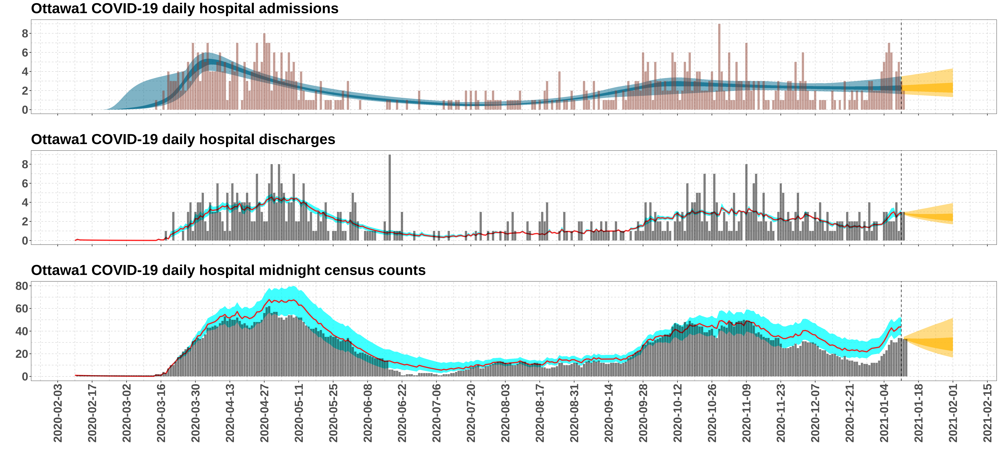

# Hierarchical Bayesian model for Ottawa COVID-19 hospital occupancy forecast

This analysis/forecast pipeline is an adaptation of the hierarchical model
described by Flaxman et al. in:

https://www.imperial.ac.uk/mrc-global-infectious-disease-analysis/covid-19/report-13-europe-npi-impact/

or directly:

https://www.imperial.ac.uk/media/imperial-college/medicine/mrc-gida/2020-03-30-COVID19-Report-13.pdf

The authors:

*  sought to estimate the effect of the various COVID-19 (social distancing)
   intervention measures on the jurisdiction-specific time-varying
   reproduction number *R<sub>m,t</sub>*,
   for jurisdiction *m*, as a function of time *t* (in days),

*  proceeded by fitting a hierarchical Bayesian model to the COVID-19 death count
   time series from the following eleven European jurisdictions:
   Austria,
   Belgium,
   Denmark,
   France,
   Germany,
   Italy,
   Norway,
   Spain,
   Sweden,
   Switzerland, and
   the United Kingdom

*  generated COVID-19 death count forecast using the fitted model.

The authors have very kindly made available their code here:

https://github.com/ImperialCollegeLondon/covid19model/releases/tag/v1.0

We describe our adaption below.

## Summary: our adaptation of the Flaxman et al. model for Ottawa COVID-19 hospital occupancy forecast

For the Ottawa COVID-19 hospital occupancy forecast, we constructed two separate
hierarchical Bayesian models:

*   Model 1: daily new hospital admission counts,
*   Model 2: hospital length of stay.

The desired occupancy forecast is then obtained by suitably combining
the results of the two sub-models.

The present pipeline assesses the effectiveness of our model
for hospital occupancy forecast by applying separately the model
eight times, each time with a different training data cut-off
(more precisely, eight consecutive Mondays: 2020-11-13, 2020-11-30, ... , 2021-01-11),
and examines the agreement between the actual hospital occupancy
and the model forecast in the three-week window immediately folllowing
the training data cut-off.

# Model 1: Daily new hospital admission counts (reproduction number change-point model)

The main inference target of Model 1 is
(observed) COVID-19 daily new hospital admission counts.
Model 1 stipulates probabilistic assumptions on how
(observed) daily new admission counts are related to
(unobserved) daily new infection counts (via a **random delay**) and
(unobserved) time-varying reproduction number,
treating the latter two as latent variables (or, secondary inference targets).

The following is the list of the components of the model, and their relations
among one another.

*  Observed daily COVID-19 hospital admission count

   Assumed to follow a **Negative Binomial** distribution
   (which can be regarded as Gamma-mixture of Poisson distributions),
   which is specified by two parameters:

   *  *d<sub>t</sub>*
      = mean of the Negative Binomial
      = expected number of COVID-19 hospital admission on day *t*
   *  variance of the Negative Binomial, assumed to take the form
      *d<sub>t</sub> + (d<sub>t</sub>)<sup>2</sup>/&Psi;*

*  *&Psi;* is assumed to have been sampled from
   the rectified Gaussian distribution *Normal<sup>+</sup>(0,5)*.

*  The expected number *d<sub>t</sub>* of COVID-19 hospital admissions
   on day *t* is assumed to be given by:
   <br/>
   <br/>
   
   <br/>

   
   <br/>

   
   <br/>

   for *t* = 1, 2, ... , where
   *  *c<sub>&tau;</sub>* is the *unobserved* number
      of **new** COVID-19 infected individuals on day *&tau;*, and
   *  *&pi;<sub>&tau;</sub>* is the probability that a COVID-19 infected
      person will be admitted to hospital for COVID-19
      *&tau;* days after COVID-19 infection.

*  Flaxman et al. assumed that each jurisdiction *m* has its own
   (weighted) *infection fatality ratio* IFR<sub>*m*</sub> (probability of COVID-19 death given COVID-19 infection).
   Conversely, in jurisdiction *m*, a COVID-19 infected individual has a probability of 1 - IFR<sub>*m*</sub>
   that he/she will not die from the disease, i.e. will recover.

   For a COVID-19 infected individual who dies from COVID-19, Flaxman et al. assumed,
   based on earlier studies, that the infection-to-death delay is the sum of two durations:
   the infection-to-(symptom-onset) delay, and the (symptom-onset)-to-death delay.
   The former is assumed -- for all jurisdictions -- to have been sampled from
   the Gamma distribution *&Gamma;(5.1,0.86)*, while the latter from *&Gamma;(18.8,0.45)*,
   where the (mean,cv)-parametrization of the Gamma distribution is used.

   In our case, we need to replace the (symptom-onset)-to-death delay with
   the (symptom-onset)-to-(hospital-admission) delay.
   For simplicity, we took this latter delay to be half of the former.

   More technically, these assumptions translate to the assumption that the parameter
   *&pi;<sub>&tau;</sub>* above is given by:
   </br>

   
   </br>

   and
   </br>

   
   </br>

   for *&tau;* = 2, 3, ... , where *&pi;* is the probability density
   of the of infection-to-hospitalization delay, and
   is assumed to have the form:

   

   where IHR stands for the COVID-19 *infection hospitalization rate* of Ottawa,
   and it is set to be 0.026 in our model.

*  The number *c<sub>t</sub>* of COVID-19 infected individuals newly infected
   on day *t* is assumed to satisfy the following recurrence relation:
   <br/>
   <br/>

   
   <br/>
   <br/>

   
   <br/>
   <br/>

   
   <br/>
   <br/>

   
   <br/>

   where *R<sub>t</sub>* is the COVID-19 **reproduction number** on day *t* (see below),
   <br/>

   
   <br/>

   and
   <br/>

   
   <br/>

   where *g* is, for all jurisdictions, the probability density
   of the *serial interval distribution*.
   We remark that the discretized-to-the-day serial interval distribution
   (determined precisely by *g<sub>1</sub>*, *g<sub>2</sub>*, *g<sub>3</sub>*, ...)
   gives the probability that an infected individual will infect someone else
   on the *t*-th day after his/her original infection.

*  Lastly, our change-point model assumes that the COVID-19 reproduction number
   *R<sub>t</sub>* has the following form:

   
   <br/>

   where

   *   *&gamma;<sub>k</sub>* is
       the (random, unobserved) time of occurrence of
       the *k*-th change-point in the COVID-19
       time-varying reproduction number for jurisdiction *m*,
       with the following priors:
       </br>

       
       </br>

       
       </br>

       
       </br>

       
       </br>

       where **maxChgPt4** is last day of data availability less 14 days.

   *   *&alpha;<sub>k</sub>*
       is the (random, unobserved) log-linear change (''step size'')
       in reproduction number at the *k*-th change-point for jurisdiction *m*,
       with the following priors:
       </br>

       
       </br>

       
       </br>

       
       </br>

       
       </br>

   *   *I(t-&gamma;<sub>k</sub>)* is the binary indicator variable,
       which indicates whether time *t* is
       before (*I(t-&gamma;<sub>k</sub>) = 0*) or
       after (*I(t-&gamma;<sub>k</sub>) = 1*)
       the *k*-th change-point.

   *   *R<sub>0</sub>* is the jurisdiction-specific initial reproduction number,
       assumed to follow:
       </br>

       
       </br>

       where *&kappa;* is also a jurisdiction-independent (random, unobserved) parameter.


# Model 2: Ottawa COVID-19 hospital length of stay

Model 2 assumes that the Ottawa COVID-19 hospital length of stay follows
a Gamma distribution.
The main inference targets are thus simply
the shape and rate parameters of the family of Gamma distributions.
The observed data are the daily hospital admission counts and
daily discharge/death counts (derived from admission and midnight census counts).
The probabilistic assumptions of Model 2 stipulates the random delay
between hospital admission and discharge/death.

Observed variables:

*  The expected number *d<sub>t</sub>* of COVID-19 hospital admissions
   on day *t* is assumed to be given by:
   <br/>
   <br/>
   
   <br/>
   
   <br/>

*  Unobserved (but unambiguously derivable) variables:
   <br/>
   <br/>
   
   <br/>

Deterministic relation among *A<sub>t</sub>*, *C<sub>t</sub>* and *D<sub>t</sub>*
(from which *D<sub>t</sub>* can be derived from *A<sub>t</sub>* and *C<sub>t</sub>*):
   <br/>
   <br/>
   
   <br/>

Likelihood assumptions:

   
   <br/>

   
   <br/>

   
   <br/>

   
   <br/>

   
   <br/>

Prior distribution assumptions:


<br/>


<br/>


<br/>


<br/>

Note that
{\color{white}.})
gives the (mean,cv)-parametrization of the family of Gamma distributions,
instead of the more standard (shape,rate)-parametrization.
We find it intuitively easier to impose prior distributions
in terms of the (mean,cv)-parametrization.

#  Ottawa COVID-19 hospital occupancy forecast

   We now describe how the expected hospital occupancy forecast
   
   can be obtained from the estimates and forecasts from Model 1 and Model 2:
   <br/>

   

   

   

   where
   
   denotes last day of data availability (training data cut-off), and
   <br/>
   <br/>
   

   

# What the pipeline does

# Requirements

*  R (statistical computing software)

*  R packages: bayesplot, cowplot, data.table dplyr, EnvStats, gdata, ggplot2,
   ggpubr, gridExtra, lubridate, matrixStats, readr, readxl, RColorBrewer,
   rstan, scales, tidyr

*  Tested on:
   *  R version v4.0.3, Ubuntu 20.04.1 LTS, x86_64-conda-linux-gnu (64-bit)
   *  R version v4.0.2, macOS 10.16, x86_64-apple-darwin17.0 (64-bit)

# How to execute the pipeline

Clone this repository by running the following at the command line:

```
git clone https://github.com/kennethchu-statcan/covid19.git
```

Change directory to the folder of this pipeline in the local cloned repository:

```
cd <LOCAL CLONED REPOSITORY>/303-occupancy-ottawa/
```

If you are using a Linux or macOS computer, execute the following shell script
(in order to run the full pipeline):

```
.\run-main.sh
```

This will trigger the creation of the output folder
`<LOCAL CLONED REPOSITORY>/303-changepoint-ottawa/output/`
if it does not already exist, followed by execution of the pipeline.
All output and log files will be saved to the output folder.
See below for information about the contents of the output folder.

# Input files

All required input data and metadata files are located in
`<LOCAL CLONED REPOSITORY>/000-data/2021-01-15.01/`.

*   __raw-covid19-Ottawa.csv__

    Ottawa COVID-19 open data (including daily new confirmed case counts,
    daily new hospital admission counts, daily hospital midnight census counts).

    Downloadable at: https://opendata.arcgis.com/datasets/6bfe7832017546e5b30c5cc6a201091b_0.csv

    See the following download script to examine how the data file was retrieved:

    `<LOCAL CLONED REPOSITORY>/000-data/2021-01-15.01/run-wget.sh`

*   __infection-hospitalization-rate.csv__

    This CSV file contains the estimates of the infection hospitalization rate
    (IHR) for Ottawa, estimated to be 0.026 at time of implementation
    of the present model.

*   __serial-interval.csv__

    This CSV file contains the assumed (discrete) *serial interval distribution*
    used by the model of Flaxman et al.
    Given a duration *t* (in days), the serial interval distribution gives
    the probability that an infected individual will infect someone else
    on the *t*-th day after his/her original infection.

# Main output files

*  __`<LOCAL CLONED REPOSITORY>/303-changepoint-ottawa/output/cutoff-2021-01-11/plot-occupancy-cowplot-01-Ottawa.png`__

   

   Top panel: The vertical red bars illustrate the observed
   Ottawa COVID-19 daily **new hospital admission counts**.
   The dark blue ribbon indicates the 95% credibility
   interval of the estimated *expected*
   Ottawa COVID-19 daily new hospital admission counts,
   while the light blue indicates the 50% credibility interval.
   The vertical dashed line towards the right indicates the training data
   cut-off, which is 2021-01-11 in the plot above.
   The light orange ribbon indicates the 95% credibility interval of the
   **forecast** expected daily new hospital admissions,
   while the dark orange indicates the 50% credibility interval.

   Middle panel: The vertical black bars illustrate the observed
   Ottawa COVID-19 daily hospital **discharges/deaths**.
   The cyan ribbon indicates the 95% credibility
   interval of the estimated *expected*
   Ottawa COVID-19 daily hospital discharges/deaths,
   while the red line indicates the posterior median.
   The light orange ribbon indicates the 95% credibility interval of the
   forecast expected
   Ottawa COVID-19 daily hospital discharges/deaths,
   while the dark orange indicates the 50% credibility interval.

   Bottom panel: Similar to middle panel, but for
   Ottawa COVID-19 daily hospital **midnight census counts**.

*  __`<LOCAL CLONED REPOSITORY>/303-changepoint-ottawa/output/cutoff-2021-01-11/plot-occupancy-cowplot-01-Ottawa1.png`__

   

   This plot illustrates the results of a replicate run
   (which we call **Ottawa1**).
   The purpose of the replication here is to provide minimal assessment
   of the stability of the model with respect to random initializations
   of the MCMC inference procedure.

*  __`<LOCAL CLONED REPOSITORY>/303-changepoint-ottawa/output/cutoff-2021-**-**/plot-occupancy-cowplot-01-Ottawa.png`__

   Counterparts of the preceding plots for the other training data cut-off
   dates (8 consecutive Mondays):
   2020-11-23, 2020-11-30, ... , 2021-01-11.

*  __`<LOCAL CLONED REPOSITORY>/303-changepoint-ottawa/output/cutoff-2021-01-11/plot-ChgPt-cowplot-Ottawa.png`__

   

   Main output graphic of Model 1.

   First panel (from top):
   The vertical red bars illustrate the observed
   Ottawa COVID-19 daily **new confirmed case counts**.
   (Note that the true infection counts are unknown.)
   The dark blue ribbon indicates the 95% credibility interval
   of the estimated *expected*
   Ottawa COVID-19 daily true new infection counts,
   while the light blue indicates the 50% credibility interval.
   The vertical dashed line towards the right indicates the training data
   cut-off, which is 2021-01-11 in the plot above.

   Second panel:
   The vertical red bars illustrate the observed
   Ottawa COVID-19 daily **new hospital admission counts**.
   The dark blue ribbon indicates the 95% credibility
   interval of the estimated *expected*
   Ottawa COVID-19 daily new hospital admission counts,
   while the light blue indicates the 50% credibility interval.
   The light orange ribbon indicates the 95% credibility interval of the
   **forecast** expected daily new hospital admissions,
   while the dark orange indicates the 50% credibility interval.

   Third panel:
   The light green ribbon indicates the 95% credibility interval of the
   expected daily reproduction number,
   while the dark green indicates the 50% credibility interval.

   Fourth panel:
   The daily reproduction number in Model 1 is modelled via a
   change point model, with four change points.
   This panel illustrates the posterior distributions of the occurrence
   times, change directions and change magnitudes of the four change points.

*  __`<LOCAL CLONED REPOSITORY>/303-changepoint-ottawa/output/cutoff-2021-01-11/plot-LoS-expected-cowplot-Ottawa1.png`__

   

   Main output graphic of Model 2.

   First panel (from top):
   The vertical black bars illustrate the observed
   Ottawa COVID-19 daily hospital **new admission counts**.

   Second panel:
   The vertical black bars illustrate the observed
   Ottawa COVID-19 daily hospital **discharges/deaths**.
   The cyan ribbon indicates the 95% credibility
   interval of the estimated *expected*
   Ottawa COVID-19 daily hospital discharges/deaths,
   while the red line indicates the posterior median.

   Bottom panel: Similar to second panel, but for
   Ottawa COVID-19 daily hospital **midnight census counts**.

*  __`<LOCAL CLONED REPOSITORY>/303-changepoint-ottawa/output/cutoff-2021-01-11/plot-LoS-scatter-mu-cv-Ottawa.png`__

   

   (Joint) posterior distribution of the model parameters of Model 2.
   For ease of interpretation, we illustrate the posterior distribution
   with respect to the (mean,cv)-parametrization
   of the family of Gamma distributions,
   instead of the more standard (shape,rate)-parametrization,
   though the latter is the one used during computations.
